<h1 align="center">Hi 👋, I'm Lipika Sharma</h1>
<h3 align="center">AI Consultant from India 🇮🇳 | Helping businesses turn data into intelligent solutions</h3>

  

  

- 🤖 I work as an **AI Consultant**, designing and delivering AI & data-driven solutions

- 🧠 Focus areas: **Generative AI, AI Agents, LLM applications & Machine Learning**

- 🦾 Building **agentic AI workflows** with **Claude** and other LLMs

- ☁️ Working across **Microsoft Azure** and **AWS** cloud platforms

- 🌱 I’m currently learning **Databricks**

- 💬 Ask me about **Python, AI strategy, GenAI use cases, AI Agents**

- 👩‍🔬 Proud to be a **Woman in STEM** — keep the circle moving! 💜

- 📫 How to reach me: **ast.lipika@gmail.com**

<h3 align="left">Currently exploring:</h3>

<h3 align="left">Connect with me:</h3>

<h3 align="left">Languages and Tools:</h3>

---

<i>💜 Women in STEM — lift as you climb, and keep the circle moving. 💜</i>

